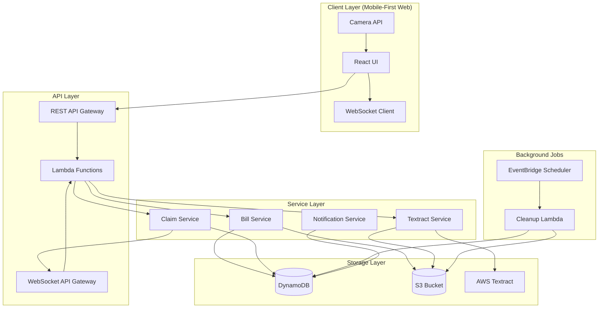

# Design Document: TabShare

## Overview

TabShare is a mobile-first web application that enables restaurant groups to fairly divide bills using automated receipt analysis. The system leverages AWS Textract for OCR processing, real-time WebSocket connections for collaborative item claiming, and a responsive UI optimized for mobile devices.

### Key Features
- Receipt image capture via mobile camera or file upload
- Automated line item extraction using AWS Textract
- Real-time collaborative bill splitting with live updates
- Flexible item claiming (full, partial, or shared)
- Automatic tax, tip, and fee distribution
- QR code and multi-channel sharing
- 30-day automatic data retention

## Architecture

### High-Level Architecture



### Technology Stack

**Frontend:**
- React 18+ with TypeScript
- Tailwind CSS for mobile-first responsive design
- WebSocket client for real-time updates
- HTML5 Camera API for image capture
- QR code generation library (qrcode.react)

**Backend:**
- AWS Lambda (Node.js/TypeScript) for serverless compute
- API Gateway (REST + WebSocket) for API management
- DynamoDB for data persistence
- S3 for receipt image storage
- AWS Textract for OCR processing
- EventBridge Scheduler for automated cleanup

**Infrastructure:**
- AWS CDK for IaC
- CloudWatch for logging and monitoring

## Components and Interfaces

### 1. Frontend Components

#### Mobile Camera Component
```typescript
interface CameraComponentProps {
  onCapture: (imageBlob: Blob) => void;
  onCancel: () => void;
}
```

#### Bill Upload Component
```typescript
interface BillUploadProps {
  onUpload: (file: File) => Promise<void>;
  isProcessing: boolean;
}
```

#### Bill Sharing Component
```typescript
interface BillSharingProps {
  billId: string;
  shareUrl: string;
}
```

#### Real-Time Bill View Component
```typescript
interface BillViewProps {
  billId: string;
  isPayer: boolean;
  userId: string;
}

interface LineItemDisplay {
  id: string;
  name: string;
  price: number;
  claims: ClaimInfo[];
  remainingPercentage: number;
  isShared: boolean;
  sharedAmongCount?: number;
}
```

#### Payer Dashboard Component
```typescript
interface PayerDashboardProps {
  billId: string;
}

interface ParticipantSummary {
  id: string;
  name: string;
  subtotal: number;
  taxShare: number;
  tipShare: number;
  feeShare: number;
  total: number;
  claimedItems: string[];
}
```

### 2. Backend Services

#### Bill Service
```typescript
interface BillService {
  createBill(payerId: string, receiptImage: Buffer): Promise<Bill>;
  getBill(billId: string): Promise<Bill>;
  updateBillAmounts(billId: string, updates: AmountUpdates): Promise<Bill>;
  deleteBill(billId: string): Promise<void>;
}

interface Bill {
  id: string;
  payerId: string;
  receiptImageUrl: string;
  lineItems: LineItem[];
  extractedTax: number;
  extractedTip: number;
  adjustedTax?: number;
  adjustedTip?: number;
  additionalFees: Fee[];
  createdAt: string;
  expiresAt: string;
  shareUrl: string;
  status: 'processing' | 'ready' | 'error';
}
```

#### Claim Service
```typescript
interface ClaimService {
  createClaim(billId: string, participantId: string, itemId: string, percentage: number): Promise<Claim>;
  updateClaim(claimId: string, percentage: number): Promise<Claim>;
  deleteClaim(claimId: string): Promise<void>;
  calculateParticipantTotals(billId: string): Promise<ParticipantTotal[]>;
}

interface Claim {
  id: string;
  billId: string;
  participantId: string;
  participantName: string;
  itemId: string;
  percentage: number;
  amount: number;
}
```

#### Textract Service
```typescript
interface TextractService {
  analyzeReceipt(imageKey: string): Promise<ReceiptAnalysis>;
}

interface ReceiptAnalysis {
  lineItems: ExtractedLineItem[];
  tax: number;
  tip: number;
  subtotal: number;
  total: number;
  confidence: number;
}
```

### 3. API Endpoints

#### REST API

```
POST   /bills                          # Create new bill with receipt upload
GET    /bills/:billId                  # Get bill details
PATCH  /bills/:billId/amounts          # Update tax, tip, fees
GET    /bills/:billId/summary          # Get payer dashboard summary

POST   /bills/:billId/claims           # Create item claim
PATCH  /claims/:claimId                # Update claim percentage
DELETE /claims/:claimId                # Delete claim

POST   /participants                   # Register participant
```

#### WebSocket Events

```
CLAIM_CREATED   - New claim added
CLAIM_UPDATED   - Claim percentage changed
CLAIM_DELETED   - Claim removed
BILL_UPDATED    - Bill details changed
PARTICIPANT_JOINED - New participant joined
```

## Data Models

### DynamoDB Tables

#### Bills Table
- PK: BILL#<billId>
- Attributes: billId, payerId, lineItems, tax, tip, fees, createdAt, expiresAt, status

#### Claims Table  
- PK: BILL#<billId>, SK: CLAIM#<claimId>
- Attributes: claimId, participantId, itemId, percentage, amount

#### WebSocket Connections Table
- PK: CONNECTION#<connectionId>
- GSI: BILL#<billId> for broadcasting

### S3 Bucket Structure
```
receipts/<billId>/original.jpg
```

## Error Handling

- Network errors: Retry with exponential backoff
- Textract failures: Retry up to 3 times, fallback to manual entry
- Concurrency conflicts: Optimistic locking with version numbers
- WebSocket disconnects: Auto-reconnect with state sync

## Security

- Private S3 bucket with pre-signed URLs
- Input validation and sanitization
- Rate limiting on API endpoints
- 30-day automatic data deletion
